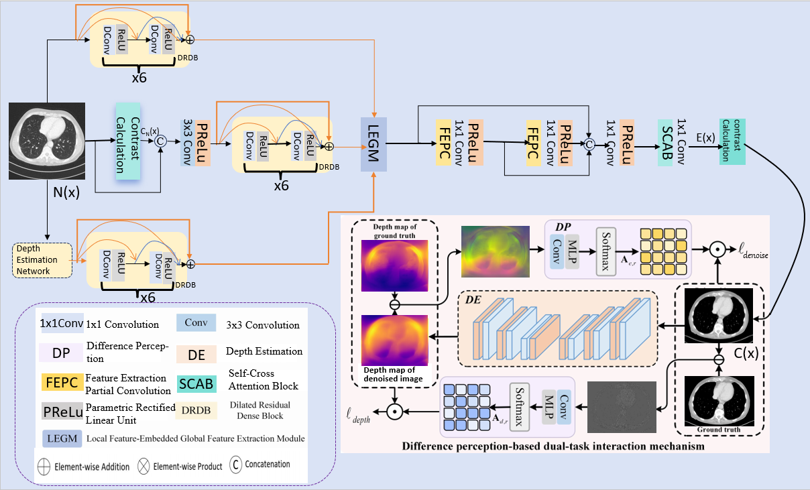
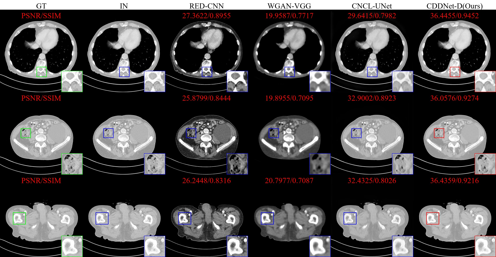
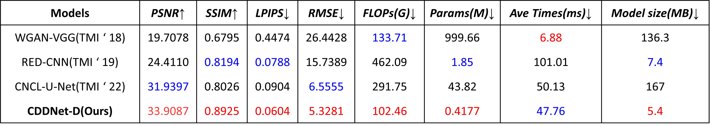
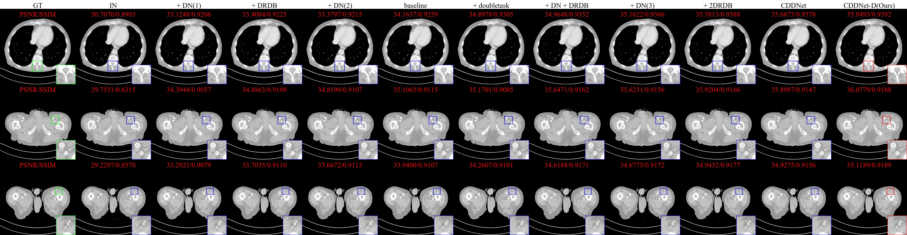

---

# Contrast Depth Dual Network for Low-Dose CT Image Denoising

**Qiyan Huang**

**Chongqing University of Posts and Telecommunications**

***arXiv***

## Abstract

Computed tomography (CT) is widely used in clinical diagnosis, but associated radiograph radiation poses cancer risks. Low-dose CT (LDCT) scanning offers a solution to reduce radiation exposure. However, lowering the radiation dose degrades image quality and can compromise diagnostic accuracy. LDCT reconstruction algorithms aim to enhance image quality without requiring full projection data. Existing deep learning methods predominantly employ end-to-end architectures that process inputs to outputs holistically. While focusing on basic block design, these approaches often stack numerous such blocks, leading to parameter redundancy and unnecessary computations, which hampers image recovery efficiency. To address this, we propose CDD-Net, a lightweight deep learning-based CT image reconstruction algorithm. Unlike conventional end-to-end networks, CDD-Net innovatively utilizes a novel two-stage framework. The first stage efficiently estimates unknown parameters (image restoration estimates) by fitting a mathematical formulation through a contrastive algorithm. Furthermore, existing methods often overlook the importance of depth information for high-quality image construction. The mechanism of LDCT image generation is inherently linked to the depth of the scene: Deeper tissues typically exhibit weaker signals and higher noise ratios, with specific noise distributions at tissue boundaries. Depth information can help networks understand these noise patterns for precise denoising. Therefore, we construct a novel dual-task collaborative learning framework, integrating image denoising with depth estimation. A discrepancy-aware mechanism is introduced to jointly optimize both networks. Experimental results demonstrate that CDD-Net effectively suppresses noise and artifacts while accurately preserving organ edges and textural details. Reconstructed images achieve visual quality comparable to high-dose CT scans and exhibit significant computational advantages, substantially accelerating image processing speeds. Our code is available at https://github.com/71-count/CDDNet.

## Framework Overview


## Results

Visual comparative experiments on the Low Dose CT Grand Challenge datasets. 


The metrics of results.


Visual ablation experiments on the dataset.


## Preparation

### Install

We test the code on PyTorch 2.6.0 + CUDA 11.7.

1. Create a new conda environment
```
conda create -n CDDNet python=3.9
conda activate CDDNet
```

2. Install dependencies
```
pip install -r requirements.txt
```

### Download

You can download the datasets on [Low Dose CT Grand Challenge](https://www.aapm.org/GrandChallenge/LowDoseCT/) or [Box](https://aapm.box.com/s/eaw4jddb53keg1bptavvvd1sf4x3pe9h).

Then you should make the file of IMA to jpg,rename a pair of images and split dataset.
All of these are already implemented in the utils folder

The final file path should be the same as the following:

```
data
    ├─ CT
    │   ├─ train
    │   │   ├─ GT
    │   │   │   └─ ... (image filename)
    │   │   └─ IN
    │   │       └─ ... (corresponds to the former)
    │   └─ valid
    │   |   └─ ...
    |   └─ test
    │       └─ ...
    └─ ... (dataset name)
```


## Training

Train your model with default arguments by running

```
python train.py
```

Training arguments can be modified in 'training.yml'.

## Inference

Conduct model inference by running

```
python inference.py --input_dir /[GT_PATH] --result_dir /[GENERATED_IMAGE_PATH] --weights /[SAVE_MODEL_PATH] --save_images
```

## Evaluation (PSNR, SSIM, LPIPS,RMSE)

```
python evaluation.py --gt_dir /[GT_PATH] --di_dir /[GENERATED_IMAGE_PATH] 
```

##  If you find our code or paper useful, please cite as

```bibtex

```
